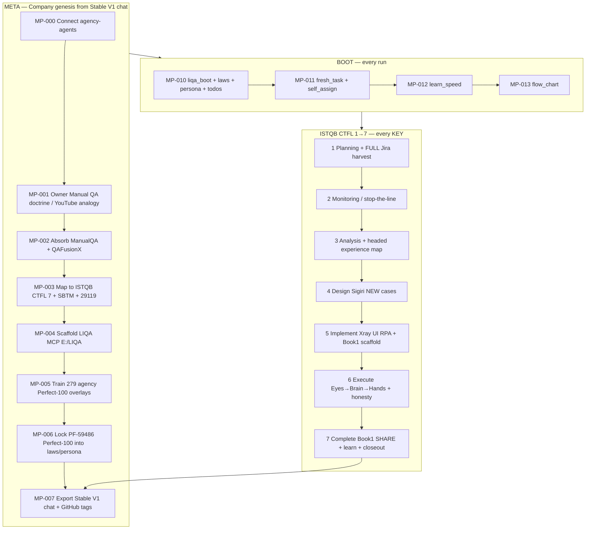
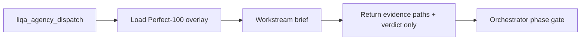
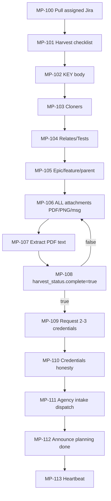
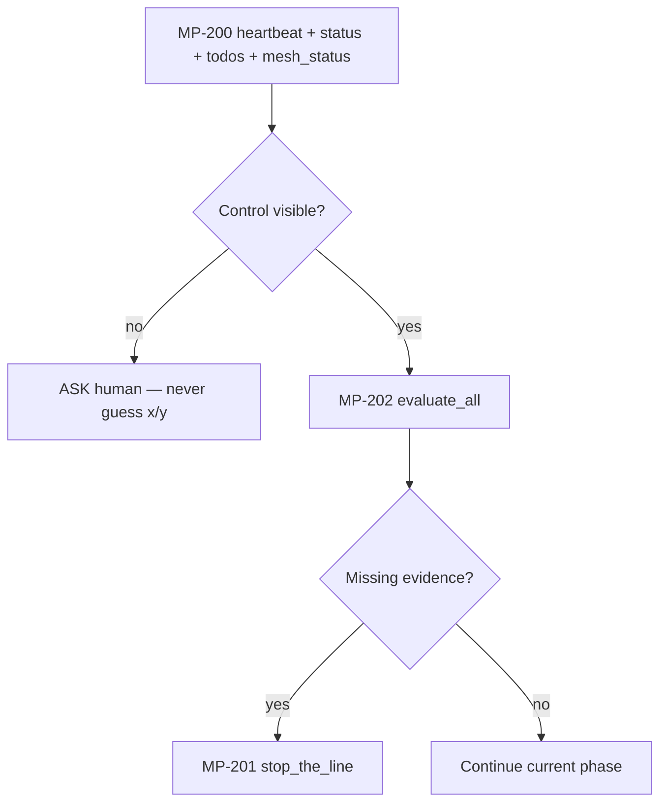
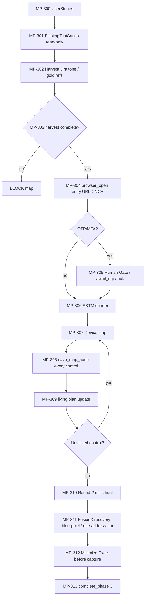
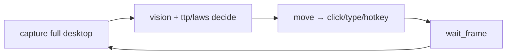
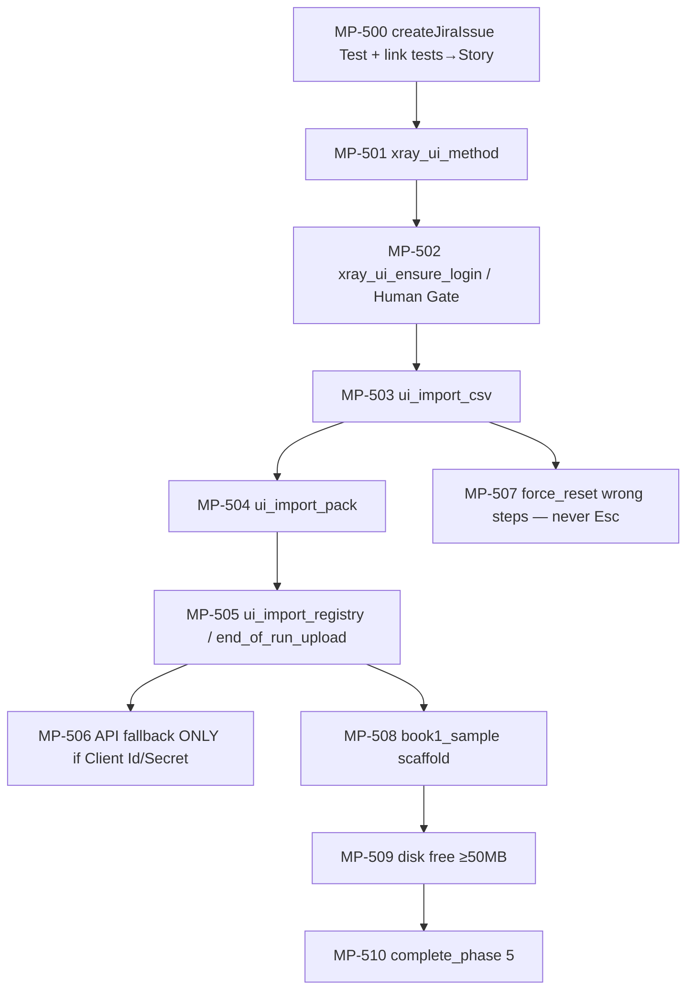
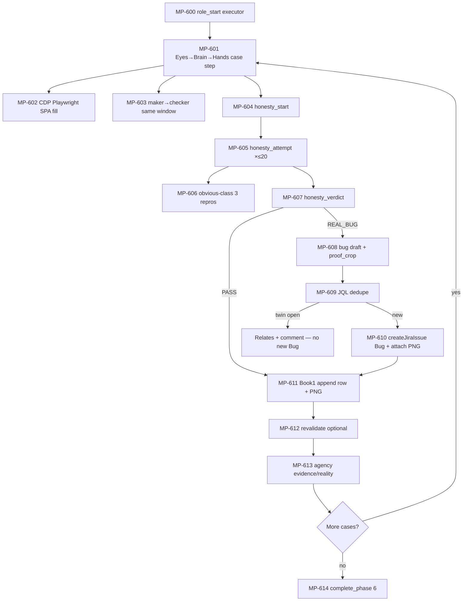
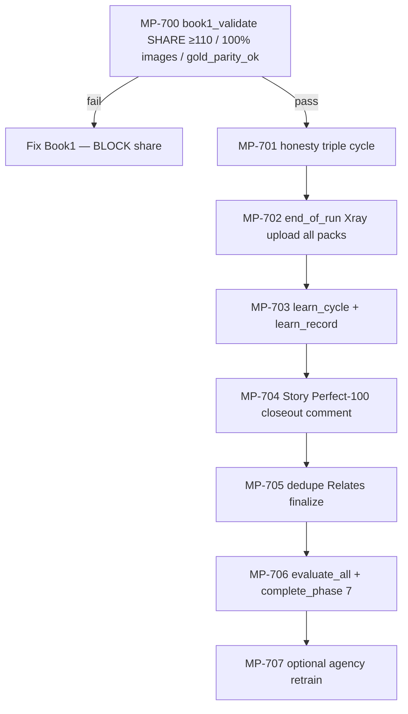
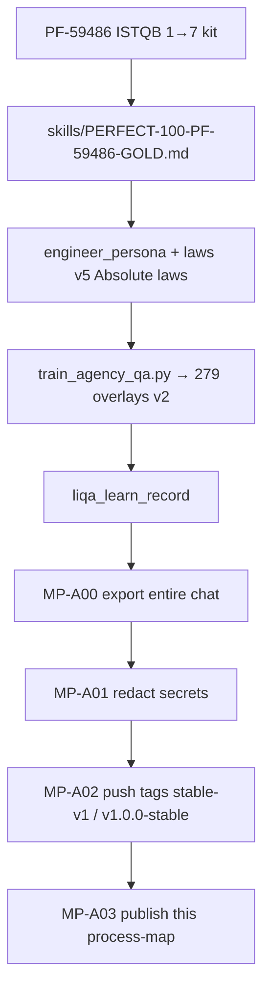

# LIQA — Complete Process Map (every micro-process)

**Locked to:** Full Stable V1 chat + Perfect-100 **PF-59486** + MCP `2026-09-16-liqa-perfect-100-v5`  
**Machine catalog:** [`MICROPROCESSES.json`](MICROPROCESSES.json) (107+ micro-processes) · [`LIQA-TOOLS.json`](LIQA-TOOLS.json) (98 tools)  
**Source chat:** [`../chat/FULL-CHAT.md`](../chat/FULL-CHAT.md)

> If someone asks how LIQA works end-to-end: give **this folder** + the Stable V1 chat.

---

## 0) Master flow (nothing skipped at macro level)



---

## 1) Agents that move on every process

### 1.1 In-process LIQA roles (always)

| Role | Mission | Primary micro-processes |
|------|---------|-------------------------|
| **orchestrator** | Phase gates, handoffs, stop-the-line | MP-010…013, MP-112, MP-200…202, phase completes |
| **intake** | Jira assign + **full harvest** + creds + stories | MP-100…113, MP-300…301 |
| **mapper** | Headed experience map (NO Pass/Fail) | MP-304…313 |
| **designer** | Sigiri NEW tests EP/BVA/state | MP-400…407 |
| **executor** | Headed run + Xray UI RPA + bugs | MP-500…507, MP-600…614 |
| **honesty_referee** | 20 approaches / obvious-3 | MP-604…607, MP-701 |
| **book1_reporter** | SHARE Book1 rows + validate | MP-508…509, MP-611, MP-700 |
| **learner** | learn_cycle / SPEED-PLAYBOOK | MP-012, MP-703, MP-707 |

### 1.2 Agency mesh (279 Perfect-100 overlays)

Every `liqa_agency_dispatch` loads `packaging/industry/agency-qa-trained/<id>.md`.

**Core specialists on Perfect-100 runs (always dispatch):**

| Specialist | When |
|------------|------|
| `agents-orchestrator` | Phase start / Perfect-100 lock |
| `evidence-collector` | Map + execute + Book1 proof |
| `reality-checker` | Harvest gates, honesty, Book1 validate, bug dedupe |
| `senior-project-manager` | Living plan / monitoring |
| `workflow-architect` | Map structure / micro-flow |
| `test-results-analyzer` | Sufficiency / evaluate_all |
| `product-manager` | Story AC / scope |
| `technical-writer` | Plain-English assignedTasks + closeout |
| `multi-agent-systems-architect` | Mesh topology |
| `code-reviewer` | MCP/law diffs when Perfect-100 uplift |

**Tracks (all 279):** domain 158 · data 44 · security 15 · gtm 13 · frontend 10 · execution 10 · platform 9 · docs 6 · orchestrator 5 · design 5 · backend 4 — see MANIFEST.



---

## 2) Phase 1 — Planning (micro)



**Folders:** `assignedTasks/<KEY>/` · `knowledgeBase/<KEY>/jira-attachments/`  
**Hard gate:** no headed map until `liqa_jira_harvest_status.complete=true`.

---

## 3) Phase 2 — Monitoring (micro)



---

## 4) Phase 3 — Analysis + experience map (micro)



**Device atomic loop (every click — MP-800…811):**



**Rules:** one headed session · mouse+keyboard after entry URL · no Pass/Fail in map · Round 2 folder must exist even if empty.

---

## 5) Phase 4 — Design (micro)

```mermaid
flowchart TD
  L[MP-400 Sigiri laws + gold steps + template] --> S[MP-401 split_paths P00…]
  S --> D[MP-402 draft Action|Data|Expected Result CSV]
  D --> V[MP-403 validate_steps + validate_title]
  V -->|fail| D
  V -->|pass| EP[MP-404 EP/BVA/state/RBAC/maker-checker]
  EP --> SUF[MP-405 sufficiency loop]
  SUF -->|not enough| D
  SUF -->|enough| AG[MP-406 agency designer dispatch]
  AG --> DONE[MP-407 complete_phase 4]
```

---

## 6) Phase 5 — Implementation / Xray UI RPA / Book1 scaffold (micro)



**Xray dialog micro-sequence (never skip):**

1. Open Test issue headed  
2. Manual steps → **Import** → **From csv...**  
3. File chooser `#xray-csv-file` (not Attachments)  
4. Map columns **Action\*** | **Data** | **Expected Result**  
5. Validate → **Import Steps**  
6. If wrong steps: **Reset Current Test Steps** (`force_reset`) then re-import  
7. Playwright **Sync must be subprocess** under MCP asyncio (Perfect-100 lock)

---

## 7) Phase 6 — Execution + honesty + bugs (micro)



---

## 8) Phase 7 — Completion (micro)



---

## 9) Perfect-100 lock + Stable V1 export (micro)



---

## 10) Folders contract (every KEY)

```
assignedTasks/<KEY>/
UserStories/<KEY>/
ExistingTestCases/<KEY>/
map/<KEY>/          (+ round-2/)
knowledgeBase/<KEY>/jira-attachments/
NewTestCases/<KEY>/sigiri-manual/Pxx/
outputs/<KEY>/      Book1 SHARE xlsx
reports/proof/<KEY>/
bugs/<KEY>/
agents/mesh/<specialist>/
secrets/            (gitignored)
```

---

## 11) External MCP / systems in the flow

| System | Used for |
|--------|----------|
| **user-liqa** | All LIQA tools (98) |
| **user-atlassian** | Jira issues, links, comments, search |
| **user-theja-humanize / device** | Full-desktop Eyes→Hands when LIQA hands wrap it |
| **Playwright + CDP :9333** | FusionX SPA + Xray UI RPA subprocess |
| **agency-agents** | 279 specialist source roles |
| **GitHub thejanaloit/LIQA** | Stable V1 + process-map publish |

---

## 12) How to use this map

1. Open [`MICROPROCESSES.json`](MICROPROCESSES.json) for the full ID list (MP-xxx).  
2. Walk mermaid sections 0→9 in order — **do not skip micro gates**.  
3. Cross-check tools in [`LIQA-TOOLS.json`](LIQA-TOOLS.json).  
4. For narrative of what actually happened: [`../chat/FULL-CHAT.md`](../chat/FULL-CHAT.md).

**Completeness claim:** every ISTQB phase micro-step, device atomic, Xray UI RPA dialog step, honesty/Book1/bug-dedupe gate, agency mesh dispatch pattern, Perfect-100 lock, and Stable V1 export path from the entire process is mapped above and enumerated in `MICROPROCESSES.json`.
