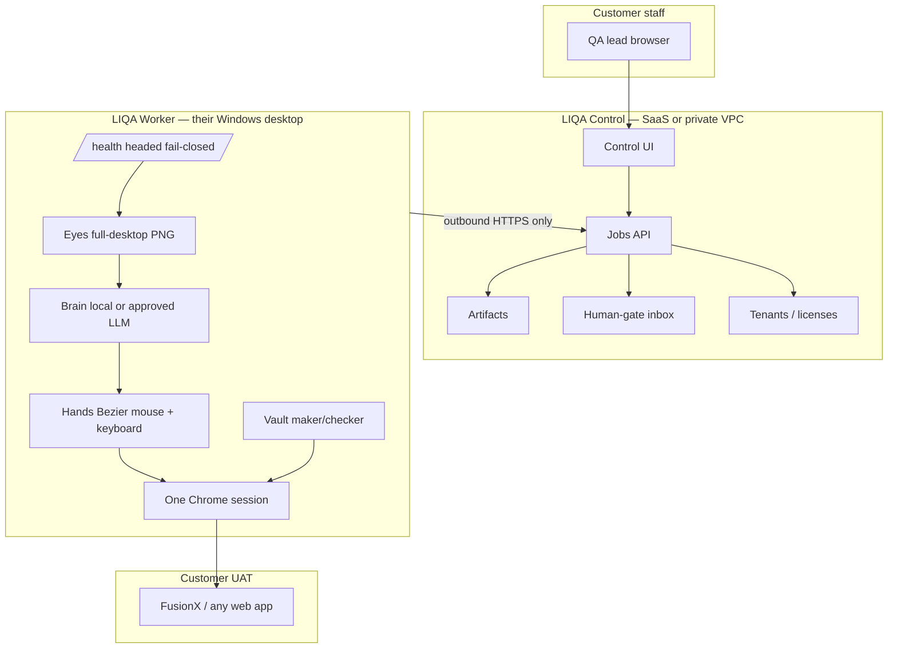

# LIQA — full product plan

**Live Intelligent QA.** External companies buy this to run **real manual QA** through our tool: headed Windows worker + Control plane + proof.

Mesh used this session: ThejaUltimate (TBB initiate + digest), theGod (TBB + completeness 90%), theVoid (fuse + constitution), ThejaBackBone (grounded packs), TTP, TCB.

## 1. What we sell

A digital QA employee that works like a human on **their** desktop:

1. They install **LIQA Worker** on a Windows QA PC/VM they own (or a dedicated desktop we host).
2. They log into **LIQA Control**.
3. They connect Jira + UAT URL. Passwords stay on the Worker.
4. They start a pack and **watch** Chrome (WebRTC / screenshot live view).
5. They download Excel, PNGs, bugs. MFA pauses for **their** human.

Customers never install Cursor. Cursor API is an **optional job dispatcher** only.

## 2. What we do not sell

- Headless cloud clicking their bank UAT
- “Paste URL, coverage tonight”
- QAFusionX pipeline as the SKU
- Cursor as a customer dependency
- Invented OTPs / bypassed 2FA

## 3. Architecture (market-aligned)

Internet patterns absorbed (docs only unless OSS license allows clone):

| Source | Pattern in LIQA |
|---|---|
| AskUI 3-layer (2026) | Brain / Hands / Worker-on-customer-device |
| Rainforest | OS mouse on a real VM + live watch |
| Steel | Headful live view (WebRTC later) |
| BrowserStack Local | **Outbound-only** worker connect |
| Karate on-prem | LLM can stay inside the bank; we **reject** their headless Docker as the core SKU |
| Midscene / computer-use MCP / Steel OSS | Reference clones under `vendor/oss/` |



Full diagrams: `docs/diagrams/architecture.md` · `docs/ARCHITECTURE.md`.

## 4. Data modes

| SKU | Screenshots | LLM |
|---|---|---|
| Bank / air-gap (default for banks) | Stay on Worker | Local Ollama/vLLM |
| Hybrid | Stay on Worker; labels may leave | Cloud LLM under their DPA |
| Cloud brain | Cropped frames to Control | Non-regulated apps only |

## 5. Repo map (now)

```
E:\LIQA\
  apps/control/     job + tenant HTTP
  apps/worker/      headed health + hands HTTP
  docs/             plan, architecture, 230 todos
  scripts/          gen_todos, dev, smoke
  tests/            health + control smoke
  vendor/           OSS references (gitignored clones)
```

Engine reuse: `E:\QAFusionX\manualQA` (humanize / device_core). Do not fork blindly.

## 6. Todo list

**230 items** in [`docs/TODO.md`](TODO.md) (`T001`–`T230`). That is the backlog. This plan does not replace it.

P0 slice (started this session): foundation docs, Control HTTP, Worker health, gitignore, Cursor key in local `.env` only.

## 7. Risks

- Windows headed VMs die when RDP disconnects → health must 503
- API keys in chat must be rotated (see SECURITY.md)
- Live view PII → bank SKU never ships pixels to our multi-tenant GPU
- Honesty: first customer week is map + format pack, not 100% coverage

## 8. Success

A company that is not LOLC can: install Worker, open Control, watch a headed run, download proof, without Cursor and without headless.
