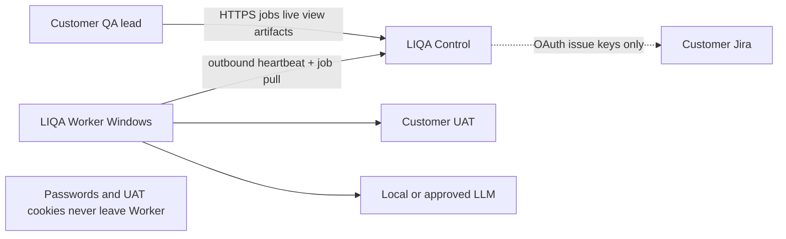
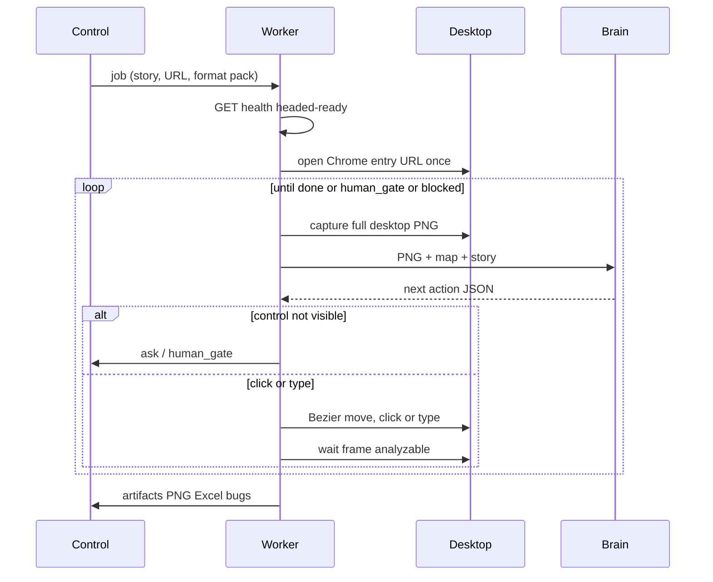
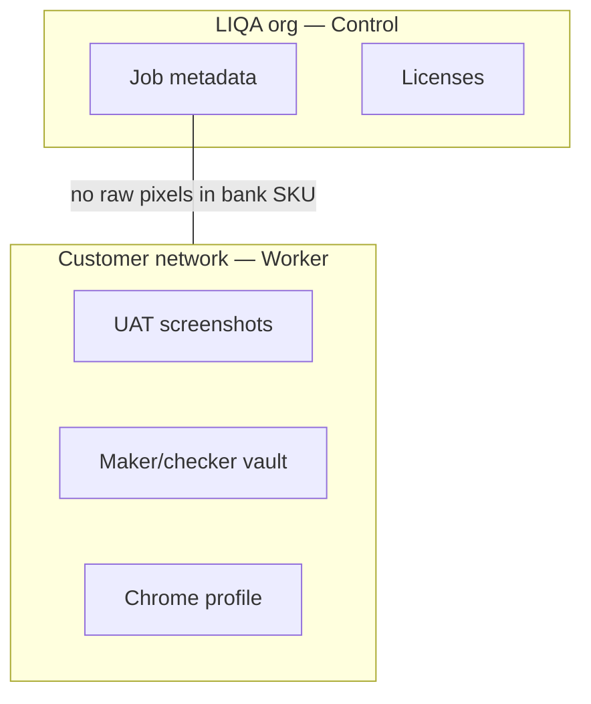

# LIQA architecture diagrams

## System context

```mermaid
flowchart LR
  Cust[Customer QA lead]
  Ctrl[LIQA Control]
  W[LIQA Worker Windows]
  Jira[Customer Jira]
  UAT[Customer UAT]
  LLM[Local or approved LLM]
  Cust -->|HTTPS jobs live view artifacts| Ctrl
  W -->|outbound heartbeat + job pull| Ctrl
  Ctrl -.->|OAuth issue keys only| Jira
  W --> UAT
  W --> LLM
  Note1[Passwords and UAT cookies never leave Worker]
```

## Worker loop (Eyes → Brain → Hands)

```mermaid
sequenceDiagram
  participant C as Control
  participant W as Worker
  participant D as Desktop
  participant B as Brain
  C->>W: job (story, URL, format pack)
  W->>W: GET health headed-ready
  W->>D: open Chrome entry URL once
  loop until done or human_gate or blocked
    W->>D: capture full desktop PNG
    W->>B: PNG + map + story
    B-->>W: next action JSON
    alt control not visible
      W->>C: ask / human_gate
    else click or type
      W->>D: Bezier move, click or type
      W->>D: wait frame analyzable
    end
  end
  W->>C: artifacts PNG Excel bugs
```

## Trust boundary

```mermaid
flowchart TB
  subgraph ours["LIQA org — Control"]
    meta[Job metadata]
    lic[Licenses]
  end
  subgraph theirs["Customer network — Worker"]
    pixels[UAT screenshots]
    creds[Maker/checker vault]
    chrome[Chrome profile]
  end
  meta ---|"no raw pixels in bank SKU"| theirs
```
